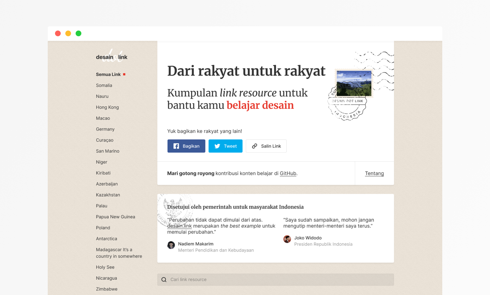
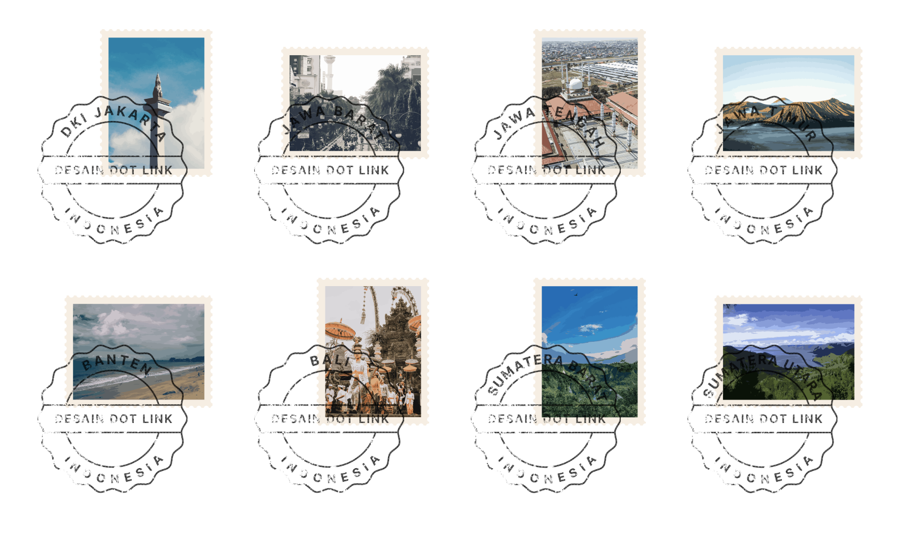
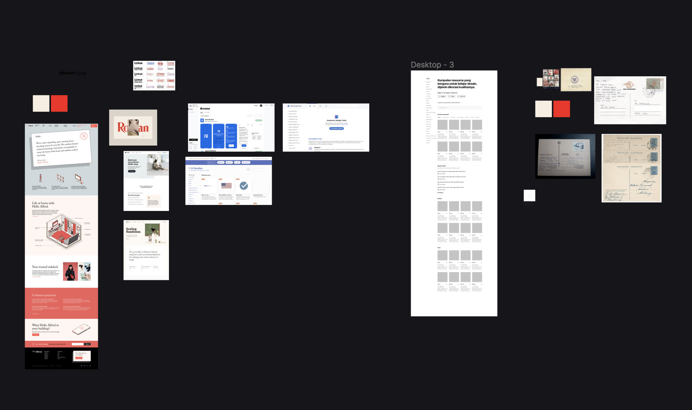

In this situation of COVID-19 pandemic, to stay sane and to stay productive, we've to keep doing that makes us happy, so it will maintain our mental health is on track. There a lot of things that can help, for example, by doing our hobbies, writing, reading, playing games, volunteering, or doing side project! Yes, another side project 😂.

Announcing my newest side project [desain.link](https://desain.link)!

### What is desain.link?

[desain.link](https://desain.link) is a curated collection of link or resource about design stuff, think like a website of bookmark link. Our focus is basically providing more inclusive, featuring talented designer in Indonesia, and discoverable collection of design link, so this website will be more localized.

This side project is partnering with my friend, [Kukuh Sulistyo](https://id.linkedin.com/in/suliskh), he is a front-end engineer. He will help me to code this from ground-up. We're really excited to work with this.

### Our Plan

Our plan is making this website accessible and SEO friendly, this why we pick up this great domain, we want everyone quickly remembers. Another note, is we want to make this site open source, so everyone can contributing more content or fixing bugs.

We're currently on the early phase of the development process. For better collaboration, we did video call routine using [Jitsi Meet](https://meet.jit.si/) every weekend and also, we use [Figma](figma.com/) for design collaboration.

The design direction and the homepage are already done. Here some screenshot of the design.

---

I think that's it for quick update of my side project. If you're reading it until the end of the page, let's connect on [Twitter](https://twitter.com/afnizarnur).
