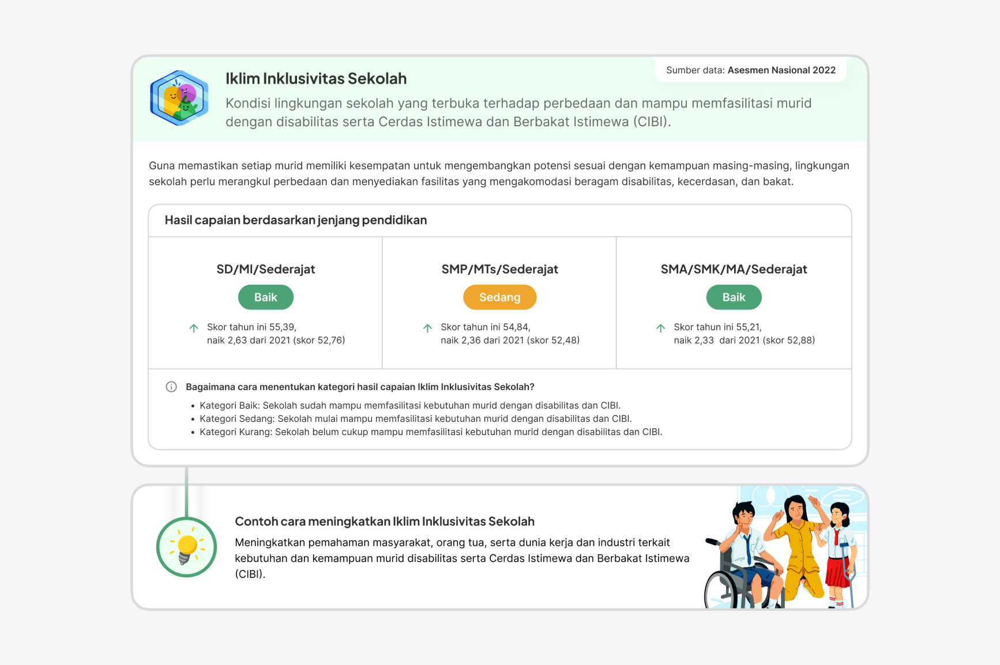

### Overview

Rapor Pendidikan Indonesia was established to enable public to view reports on Indonesia's educational achievements and collaborate to enhance the quality of education. This year's data is derived from the 2022 Education Report, compared with the 2021 data.

In this project, I used my graphic design hat to create digital infographics. It was incredibly exciting to work on this project because it allowed me to explore data visualization in a way I hadn't done in a long time. (I remember the last time I created an infographic was back in college). I also teamed up with a group of talented individuals–writer, researcher, and illustrator, each with their own unique skills. Together, our mission was to turn data into visually appealing infographics and get alignment with stakeholder.

This isn't a detailed case study; it showcases the outcomes of this project. I plan to share more the design process when I have more time. If you want to discuss any of this work in more detail, feel free to get in touch!

---

<figure>
     
</figure>

<figure>
     
</figure>

<figure>
     
</figure>
