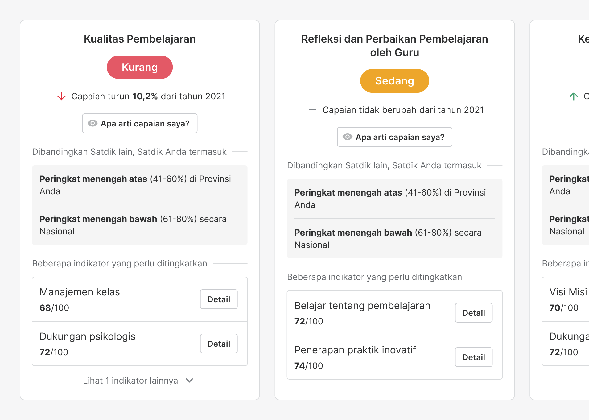
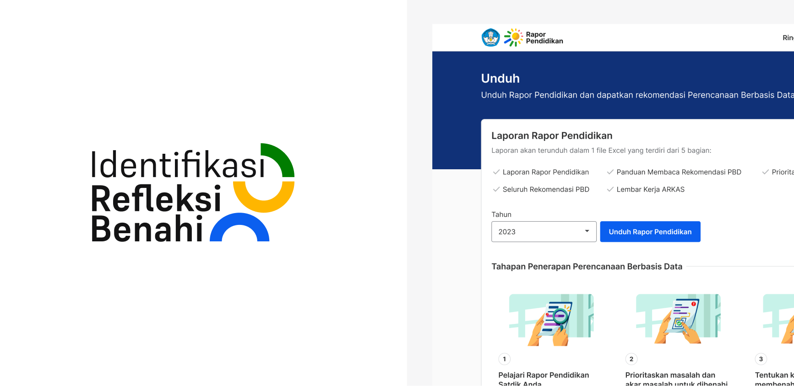
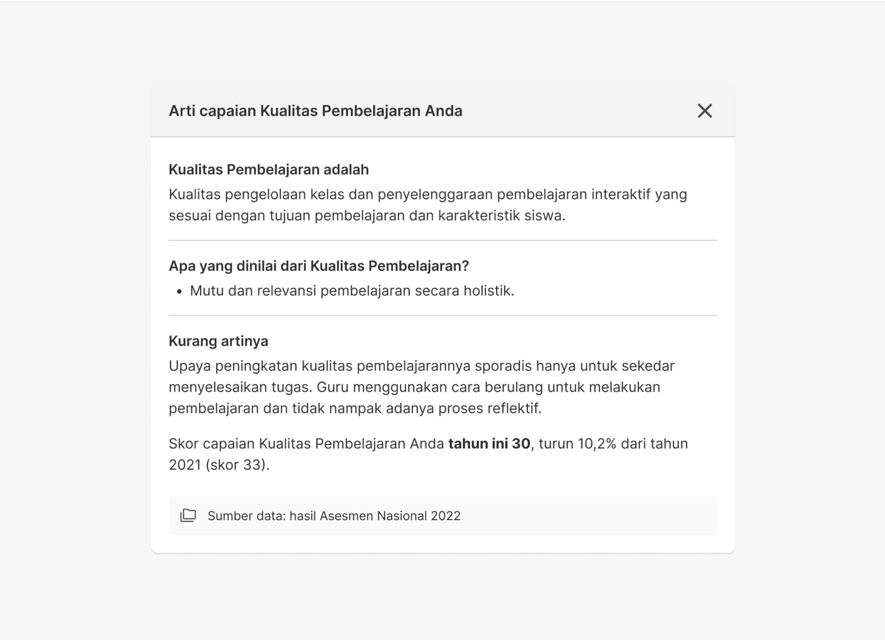
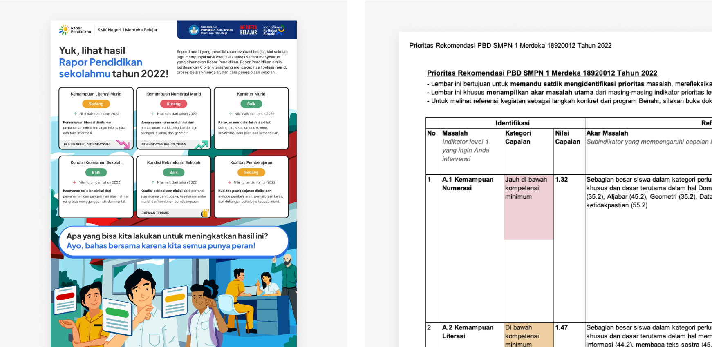

<figure>
         
        <figcaption>Preview of card detail</figcaption>
</figure>

<figure>
        
        <figcaption>Preview of IRB and Unduh page</figcaption>
</figure>

<figure>
        
        <figcaption>Preview of modal detail</figcaption>
</figure>

<figure>
        
        <figcaption>Preview of poster and excel file</figcaption>
</figure>
