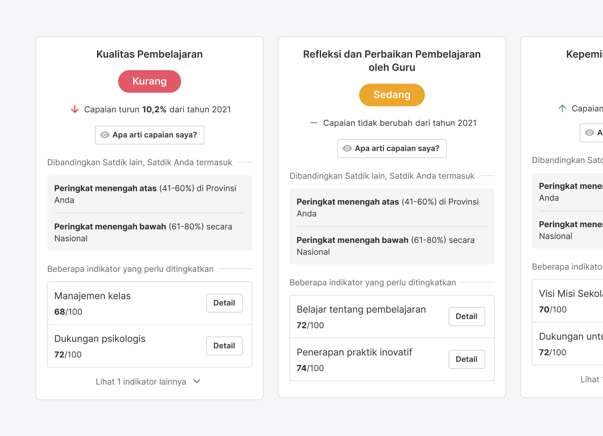
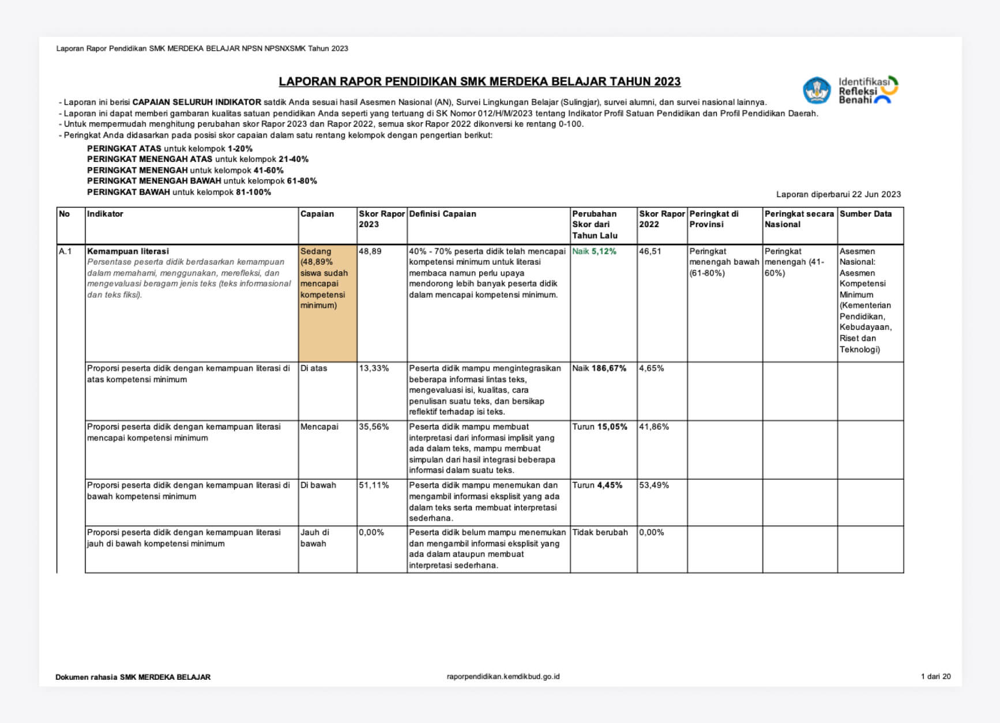

### Empowering Education in Indonesia through Comprehensive Insights

Rapor Pendidikan 2.0 is a platform that offers comprehensive data and evaluation reports on the state of education in Indonesia. Leveraging insights from the National Assessment (AN), encompassing assessments of Minimum Competency (AKM), Character Surveys, and Learning Environment Surveys, this platform provides a holistic understanding of the educational landscape.

In 2023, following the release of version 1.0 in 2022, our objective was to go beyond Rapor Pendidikan's function as a simple data visualization tool. We aimed to empower schools with practical and valuable insights that could lead to real improvements in educational quality.

By working closely with various stakeholders, including the ministry and internal teams, and conducting thorough user research, we collaboratively designed, documented, and implemented a platform. This platform empowers educators and stakeholders to identify areas of growth, reflect on educational practices, and drive positive change.

<figure>
         
        <figcaption>Conversations with users to co-create the next version of Rapor Pendidikan. Taken in Gunung Kidul, Yogyakarta.</figcaption>
</figure>

---

### Redesigning for Actionability

We approached the redesign process with a clear goal in mind: to make the platform more user-friendly and empower users to take action. To achieve this, we focused on developing a seamless flow that ensures users can easily understand their school assessment results.

Now, educational institutions have the ability to delve into the details of each dimension, gaining a deeper understanding of their performance and learning processes within their own contexts.

<figure>
         
        <figcaption>Introducing the new look of Rapor Pendidikan 2.0</figcaption>
</figure>

<figure>
        Using cards to present data effectively" /> 
        <figcaption>Using cards to present data effectively</figcaption>
</figure>

<figure>
         
        <figcaption>We also expanding accessibility by designing and developing the mobile version to ensure a seamless experience for all</figcaption>
</figure>

---

### Printability and User-Friendliness of Rapor Pendidikan Offline Files

The downloadable Rapor Pendidikan file serves as a crucial tool for educators in schools, enabling them to generate reports and analyze raw data. It also plays a vital role in fostering transparency between teachers and parents.

Recognizing the significance of this downloadable resource for schools, we identified several issues and realized the importance of creating a fully iterated version that is easily readable and printer-friendly.

<figure>
         
        <figcaption>Preview of the excel file</figcaption>
</figure>

---

### Identifikasi, Refleksi, Benahi Logo Tagline

I also contributed to the creation of the tagline that embodies the essence of Rapor Pendidikan: "Identifikasi, Refleksi, Benahi" (Identify, Reflect, Improve). Through a series of iterations, we constructed a symbol combining a search icon and indicator labels within Rapor Pendidikan, ensuring that the tagline remained closely aligned with the platform's purpose.

The tagline symbol acts as a communication bridge with schools, helping them remember the importance of data-driven planning processes. It serves as a reminder to utilize the platform for identifying areas of improvement, reflecting on practices, and driving positive change.

<figure>
         
        <figcaption>Logo tagline that used in many applications</figcaption>
</figure>